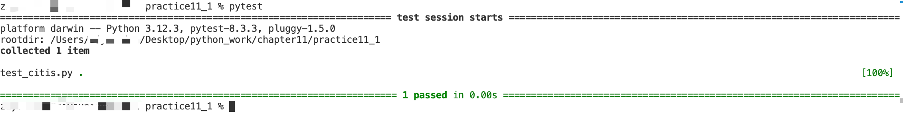
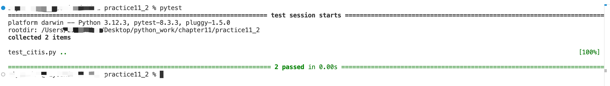
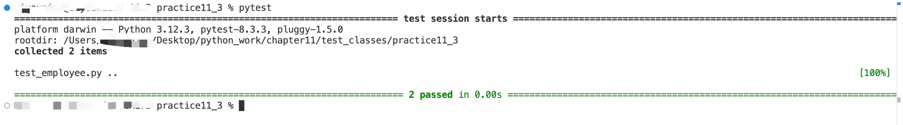

## 使用 pytest 测试代码
1. 安装 pytest

### 对函数的测试
进入 test_functions 目录
1、在practice11_1目录下，命令行执行 pytest

表示函数get_formatted_city(city, country)对输入 **'santiago', 'chile'** 可以正常处理运行，输出 **'Santiago, Chile'** ，通过测试

2、在practice11_2目录下，命令行执行 pytest

表示函数get_formatted_city(city, country, population = '')对输入
 
1️⃣ **'santiago', 'chile'** 可以正常处理运行，输出 **'Santiago, Chile'** ，通过测试
 
2️⃣  **'santiago', 'chile', 'population=5000000'** 可以正常处理运行，输出 **'Santiago, Chile - population 5000000'** ，通过测试

### 对类的测试
进入 test_class 目录
1、夹具的使用：可编写一个函数来生成供多个测试函数使用的资源，再对这个函数应用装饰器 @pytest.fixture()，并让使用该资源的每个测试函数都接受一个与该函数同名的形参。
具体实现见 survey/test_survey.py

2、在practice11_3目录下，命令行执行 pytest

表示类方法give_raise(self, raise_amount = 5000)对调用
 
1️⃣ **give_raise()** 可以正常处理运行，处理结果类实例 **give_raise.salary == 14000** ，通过测试
 
2️⃣  **give_raise('6000')** 可以正常处理运行，处理结果类实例 **give_raise.salary == 15000** ，通过测试